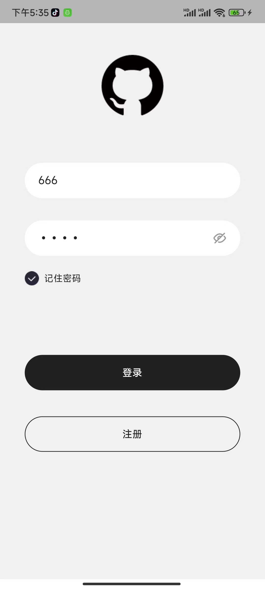
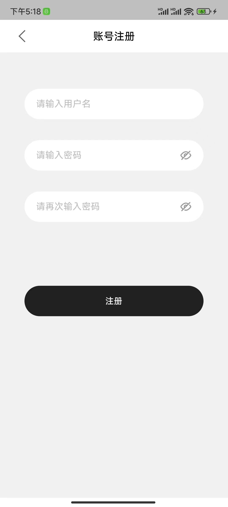
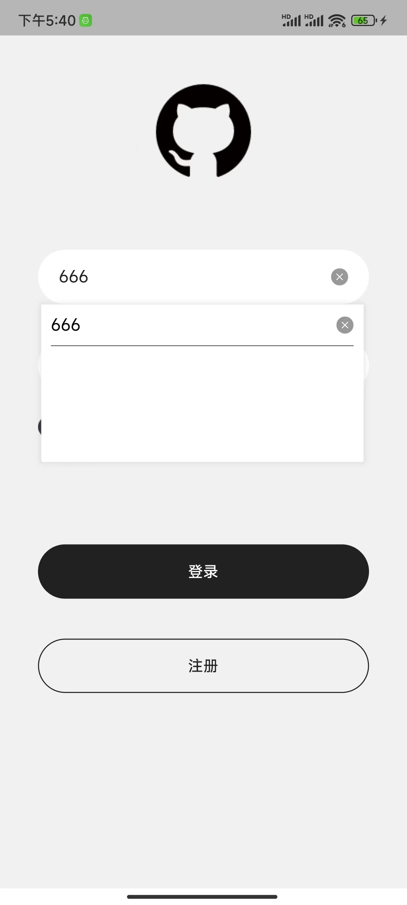

# login_demo

本项目使用Flutter实现了登录和注册功能

## 项目运行环境

    1. Flutter version 3.0.1

    2. Dart version 2.17.1 

## 设计思路

    1. 简洁明了：登录注册页应该简洁明了，避免过多的元素和干扰。使用明确的标签和易于理解的输入字段，以减少用户的困惑。
    
    2. 界面面设计：使用简单的颜色和字体、容易理解的语言、合理的布局，在登录注册页上突出显示重要的信息，例如登录和注册按钮、
    用户名和密码输入框等。这些元素应该明显突出，让用户一目了然，提高用户体验。
   
    3. UI风格：使用黑色为主题色，提示高级感。使用圆角的输入框和按钮，提升视觉舒适度、界面美观，让用户聚焦内容。
    
    4. 交互设计：使用良好的交互设计，使用Toast用于告知状态以及有错误发生的提示，比如账号不存在、密码错误等，
    及时的反馈给用户,提升用户体验。

    5. 响应式布局：采用响应式布局设计，使得页面在不同设备和屏幕尺寸下都能良好地展示和使用。
    
    6. 跨平台兼容性：利用Flutter的跨平台特性，可以开发出同时适用于Android、iOS和其他平台的登录注册页面。
    
    
    

## 开发方针

   1. 确定需求和功能：首先明确登录和注册页面的需求和功能，输入用户名和密码、提交注册信息、模拟接口逻辑以及错误处理等。
   
   2. UI界面：据需求和功能，设计登录和注册页面的UI界面。选择开发的语言，使用Flutter进行开发，利用Flutter提供
   的各种UI组件和布局来构建界面进行开发，选择合适的样式和风格，使界面更加美观和吸引人。

   3. 项目结构：使用合理的项目结构，简单明确的命名，让项目结构和功能清晰，方便阅读。
   
   4. 设计模式：采用合理的设计模式，将业务逻辑、UI展示和用户交互分离，提高代码的可维护性和可扩展性。

   5. 编程规范：遵循良好的编码规范和最佳实践，如代码注释、代码重构等，确保代码质量和可读性。
   
   6. 第三方库：充分利用第三方库和插件，简化开发工作，提高开发效率。
   
   7. 测试：在开发过程中，不断进行测试和优化以确保功能的正确性和稳定性。

## 功能亮点

   1. 响应式设计：使用Flutter的响应式设计，可以让登录注册页面在不同大小的设备上都能良好地展示和操作。
   
   2. 响应式布局：采用Flutter的Colume和Row等布局组件，实现响应式布局，适应不同设备和屏幕尺寸。
   
   3. 架构搭建：使用getx进行项目架构搭建，getx进行路由管理实现页面跳转，getx进行状态管理，更新状态。
   
   4. 自定义样式：使用自定义的样式来美化界面元素，采用圆角等设计风格，提高用户体验。
   
   5. 组件封装: 自定义封装了输入框、按钮、导航栏等组件，提高代码的复用性，快速开发。
   
   6. 工具类: 自定义封装数据存储工具类、弹窗工具类、屏幕适配等工具类。
   
   7. 嵌套优化：将Widget抽取成方法、自定义组件等，解决嵌套问题，提高代码的阅读性。

   8. 用户登录：提供登录页面，用户输入用户名和密码后，通过注册页保存的账号进行验证，实现登录功能。
   
   9. 用户注册：提供注册页面，收集用户基本信息，如用户名、密码等，通过SharedPreference保存注册的信息，
   判断注册的账号是否已存在。
   
   10. 记住密码：实现记住密码的功能，使用自定义账号下拉框，实现快速填充账号和密码功能，方便用户快速登录。
   
   11. 密码可见性：实现密码输入可见性切换功能，防止用户因不可见输入重复出错的问题。
   
   12. 跨平台兼容性：利用Flutter的跨平台特性，实现登录注册页面在Android、iOS和其他平台上的兼容性。
   
   13. 错误处理和提示：对用户输入进行验证和处理，提供错误提示，提高用户体验。

## 预览

页面效果如下：

登录页：

注册页：

记录密码：

主页：

